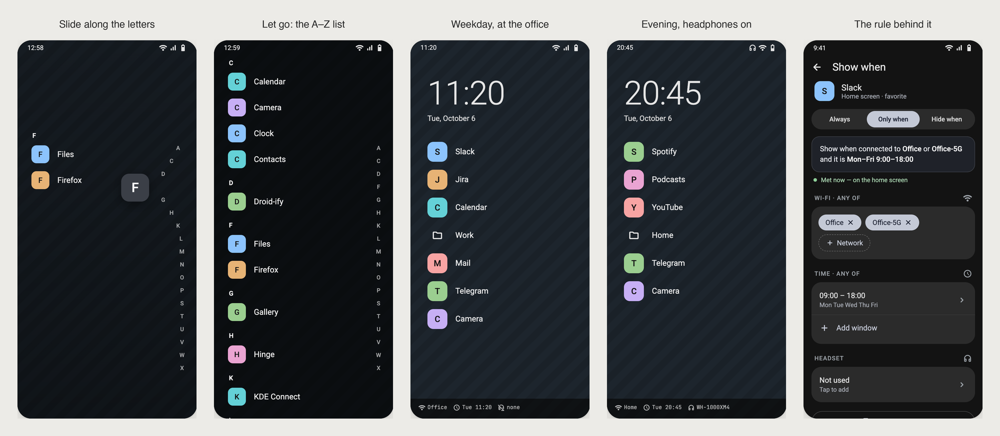

# Valeria Launcher

**Valeria is a fork of [Victoria Launcher](https://github.com/adelmonte/victoria-launcher)
that makes the home screen change with your context and helps you scroll less.**
Upstream Victoria is a minimal, list-based home screen whose favorites never move.
In Valeria every favorite — app, shortcut or folder — can have a rule that shows
or hides it depending on **which Wi-Fi you are on, the time of day, whether a
headset is connected**, or **whether today's sessions in that app are used up**.
Work apps disappear at the weekend, music apps come up with the headphones, and
Instagram leaves the home screen after its second short session of the day.
Swipe up also opens a dedicated **search screen** with the keyboard already up.
Everything else is Victoria as it was at 0.77.1.



## What is different from Victoria

**Visibility rules.** Long-press a favorite → *Show when…*. A rule is *Always*,
*Only when* or *Hide when*, built from conditions:

- **Wi-Fi** — one or more networks by name, or any Wi-Fi at all.
- **Time** — one or more time windows, with days of the week.
- **Headset** — any, wireless only, or particular Bluetooth devices.
- **Daily session limit** — e.g. *hide when today's 2 sessions are used up*,
  counted from Android's usage events. Pairs with a screen-time app such as
  ScreenZen: that app limits the sessions, the launcher removes the icon once
  they are gone, until midnight. Visits under 10 s don't count, visits a minute
  apart merge into one; both are tunable against the other app's count.

Any one value within a condition will do; every condition that is set has to hold.
A folder can have a rule, and so can each app inside it; a folder with every app
hidden is hidden too. A limit on a folder counts all its apps together.

Hidden means off the home screen only: the app stays in the A-Z list and search,
and in edit mode it is drawn faded with its rule in badges. **Show hidden for now**
in the wallpaper menu brings everything back until the screen goes off. Rules are
only evaluated while the launcher is on screen — nothing runs in the background —
and they travel in the settings export.

Permissions, asked only when a condition needs them: precise location (Android
hides Wi-Fi names behind it; an unreadable name never hides anything) and usage
access for session limits (granted by hand; without it a limit hides nothing).
Headsets need no permission.

**Search screen on swipe up.** Instead of the A-Z list with its search box, a swipe
up can bring a screen that is only search: the keyboard is already up and the best
match sits right above it. The swipe has a catch — short of it the screen only
leans out, past it it snaps in. The A-Z list and its keyboard setting are untouched.

## Install

There is no store build of Valeria yet — build it from source (see [Build](#build)).

Valeria still uses Victoria's package name, `dev.victorialauncher`, so the two
cannot be installed side by side, and since the signatures differ you have to
uninstall Victoria first. **Export settings** in Victoria before you do, and import
the file in Valeria.

Then pick it under **Settings → Apps → Default apps → Home app**.

Requires Android 8.0 (API 26) or newer.

## Getting started

The home screen starts almost empty on purpose — everything on it is put there by
you.

- **Long-press the wallpaper** for the menu: favorites, widgets, edit layout,
  settings.
- **Swipe in from either edge** for the A-Z list, then slide along the letters to
  jump to one. Tap the edge and let go to just open it.
- **Long-press any app**, on either screen, to rename it, change its icon, hide
  it, or file it in a folder.
- **Edit layout** gives you drag handles for the order and steppers for every
  gap, height and margin.

Everything else lives in Settings, which has a search box over the whole of it.

Two things are worth knowing before you go looking. Double-tapping the A-Z strip
to lock the screen needs an accessibility service, and if that toggle is greyed
out you have to allow restricted settings from App info first — Android blocks it
for anything installed outside a store. And **Export settings** is how you keep
your setup: Android's own backup deliberately skips this app, because the file
names every app you have arranged and a backup that runs without the app cannot
leave a private space out of it.

Work profiles are picked up automatically. A private space needs Android 15 or
later and the launcher set as your default home app.

## Changelog

Valeria's own changes are in the [commit history](../../commits/main) after
"Release 0.77.1". Upstream's per-release notes live in
[fastlane/metadata/android/en-US/changelogs](fastlane/metadata/android/en-US/changelogs).

## Reporting something

Problems with visibility rules, session limits or the search screen belong here;
anything that also happens in [upstream Victoria](https://github.com/adelmonte/victoria-launcher/issues)
is best reported there.

One thing per issue. A ticket with nine requests in it gets one reply covering nine
things, and the eight you did not care about bury the one you did.

For a bug, say what you did, what you expected, and what happened — and which version, on
which phone. Most of what looks broken turns out to depend on a setting, so say if you
have changed any. A screenshot or a recording is worth more than any description of how
something looks or moves.

For a request, say what you are trying to do and not only the feature you have in mind.
There is often already a way, and where there is not, knowing the goal tends to change the
shape of the answer.

## Build

You need JDK 17 and an Android SDK with platform 35.

```sh
./gradlew assembleDebug
```

Translations are very welcome — see [TRANSLATING.md](docs/TRANSLATING.md).

See [CONTRIBUTING.md](docs/CONTRIBUTING.md) for the full build and contribution
notes, and [ARCHITECTURE.md](docs/ARCHITECTURE.md) for how the code fits together.

## License

[GPL-3.0-or-later](LICENSE)
